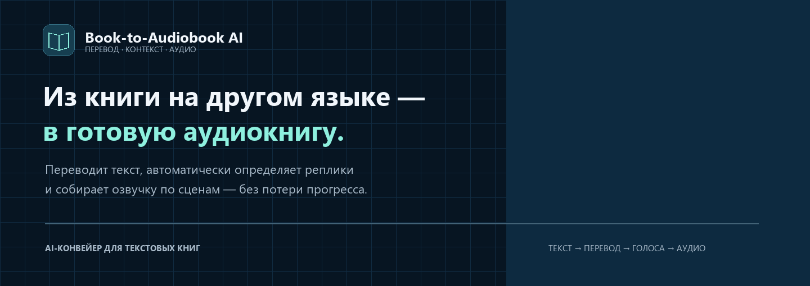
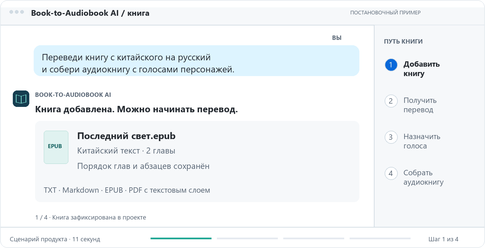
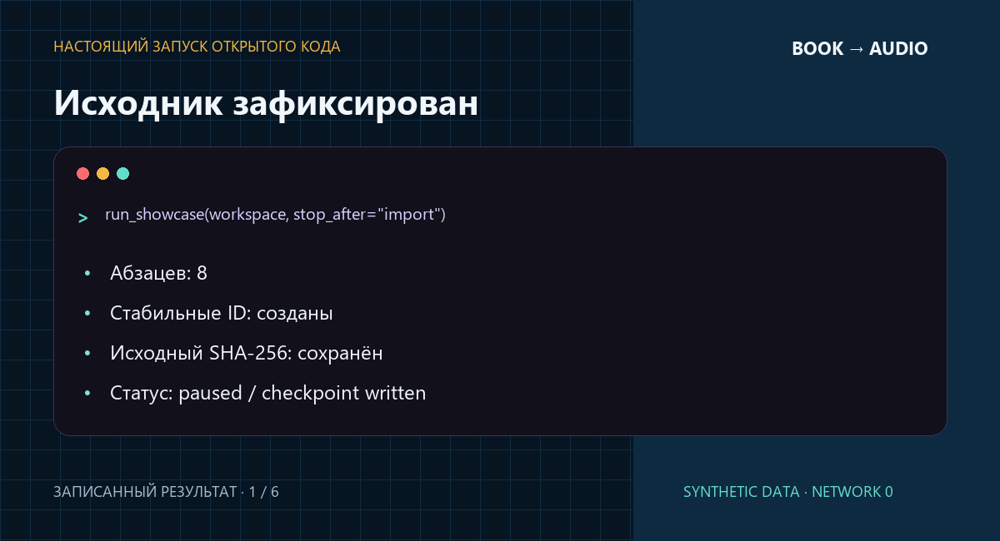

<p align="center">
  
</p>

<p align="center">
  Python 3.11+ · Демо без ключей · Синтетические данные · Только текст
</p>

<p align="center">
  <a href="#сценарий">Сценарий</a> ·
  <a href="#что-здесь-инженерного">Инженерия</a> ·
  <a href="#архитектура">Архитектура</a> ·
  <a href="#запустить-локально">Запустить</a>
</p>

> **Showcase Edition.** Открытая демонстрация проекта: выбранный оригинальный
> код и исполняемые адаптеры на синтетических данных. Внутренние алгоритмы
> продукта остаются закрытыми.

## Задача

Перевести книгу мало. Нужно сохранить структуру и имена, автоматически найти
реплики персонажей, продолжить работу после остановки и не запускать целую главу
заново из-за одного неудачного фрагмента.

**Book-to-Audiobook AI превращает этот путь в один управляемый проект — от исходного текста
до готовых глав и плейлиста.**

## Сценарий

**Сценарий закрытого продукта.** Импорт книг, модельный перевод, определение
говорящих и речевой синтез относятся к полной версии Book-to-Audiobook AI. Ниже отдельно
показан запуск открытого демо на встроенной вымышленной книге.

<p align="center">
  
</p>

| 01 · Добавить книгу | 02 · Перевести | 03 · Определить реплики | 04 · Собрать аудио |
|---|---|---|---|
| TXT, Markdown, EPUB или PDF с текстовым слоем | Сохранить структуру, имена и контрольные точки | Автоматически определить говорящих и закрепить голоса | Озвучить сцены независимо и собрать плейлист |

Поддерживается только извлекаемый текст. OCR, сканы и изображения в область
проекта не входят.

## Что это даёт

В закрытом продукте:

- перевод с сохранённой структурой и стабильными ID абзацев;
- возобновление с последнего проверенного этапа вместо старта сначала;
- автоматическое определение повествования и реплик, единый каст книги;
- адресную замену отдельных непереведённых слов при подготовке к озвучке;
- независимые контрольные точки перевода и озвучивания;
- готовые главы, аудиофайлы, манифест сборки и плейлист.

## Что здесь инженерного

### Долгая операция становится проверяемым конвейером

В открытом демо каждый этап сохраняет результат и его SHA-256 в состоянии проекта.
При повторном запуске демо проверяет уже готовые результаты и переиспользует их. Если файл
изменился вне конвейера, продолжение останавливается с явной ошибкой.

### Перевод и речь живут отдельно

В закрытом продукте книгу можно перевести сейчас, а озвучить позже; готовые
аудиофрагменты сохраняются для продолжения работы. В открытом демо перевод и
аудиорендер также разделены на этапы. Редактирование ролей и повторная сборка
изменённых сцен в публичный интерфейс не входят.

### Непереведённые слова исправляются адресно

При подготовке к озвучке закрытый продукт находит отдельные непереведённые слова
и запрашивает для них русские замены с ограниченным контекстом. Правки применяются
по адресам в отдельной копии; исходный перевод сохраняется. Автоматическую
редактуру калек, стиля и неудачных фраз этот механизм не выполняет. Если замена
не получена в пределах ограниченных попыток, слово может быть пропущено в копии
для озвучки; пропуск фиксируется в отчёте. В открытое демо этот механизм не входит.

### Контекст книги не растворяется между главами

Закрытый продукт сохраняет имена и наблюдения о событиях для контекста следующих
глав. Это помогает поддерживать связность, но не гарантирует литературное качество.
Память книги и её модельная обработка в публичной сборке только документированы.

## Архитектура

Общая схема закрытого продукта; исполняемые части публичной сборки указаны в таблице.

<p align="center">
  
</p>

| Слой | Что открыто |
|---|---|
| **Real** | Пять оригинальных deterministic-модулей: текстовые контракты, атомарные артефакты, process lock, speech chunking и произношения |
| **Adapted** | Узкий слой ошибок и публичные контракты состояния |
| **Synthetic** | Fixture-only перевод, разбор каста и генерация корректных tone WAV без сети |
| **Documented** | Реальная модельная оркестрация, память книги, recovery качества, TTS, desktop runtime и deployment |

Подробно: [архитектура](docs/ARCHITECTURE.md) ·
[возможности](docs/FEATURES.md) ·
[происхождение кода](docs/PROVENANCE.md)

<details>
<summary><strong>Посмотреть настоящий запуск открытого кода</strong></summary>

<br>

<p align="center">
  
</p>

Запись построена из файлов, созданных исполняемым demo. Это не заранее
нарисованный успешный transcript: видны завершение этапов, сохранённый checkpoint
и повторное использование артефактов.

</details>

## Запустить локально

Нужен Python 3.11 или новее. Сеть и сторонние пакеты не нужны.

```powershell
py -3.11 demo.py --tour
py -3.11 demo.py --workspace demo-output
py -3.11 demo.py --workspace demo-output
```

```powershell
py -3.11 -m unittest discover -s tests -v
py -3.11 tools/release.py --check
```

Подробнее: [инструкция запуска](docs/RUNNING.md).

## Границы открытой версии

Публичная сборка принимает только включённую вымышленную книгу. «Перевод» задан
fixture-адаптером, а WAV содержат короткие тоны, не речь. Это позволяет проверить
архитектуру, recovery и артефакты без публикации коммерческой реализации.

Сборка не является бесплатной deployable-версией закрытого продукта. См.
[NOTICE](NOTICE.md).

---

[](https://t.me/mia_ops)
